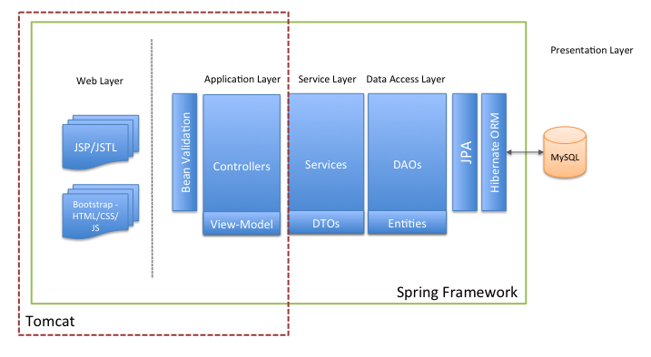

# Sales Order System

[](https://travis-ci.org/colinbut/sales-order-system)

**Project no longer actively maintained, please see: [Sales Order System 2.0](https://github.com/colinbut/sales-order-system-2.git) instead**

## Table of Contents

* [Summary](#summary)
* [Development](#development)
	* [Running Locally](#running-locally)
	* [Running Unit Tests](#running-unit-tests)
	* [Running Integration Tests](#running-integration-tests)
	* [Running End2End Tests](#running-e2e-tests)
	* [Code Quality Analysis - SonarQube](#code-quality-analysis)
	* [Running with MySQL](#running-with-mysql)
	* [Running with MongoDB](#running-with-mongodb)
* [Technical Overview](#technical-overview)
  * [High Level Architecture](#high-level-architecture)
    * [Back End](#back-end)  
    * [Front End](#front-end)
  * [Database Design](#database-design)
  * [Application Patterns](#application-patterns)
  * [Declarative Programming](#declarative-programming)
  * [Security Issues](#security-issues)
  * [Testing](#testing)
  	* [Integration Testing](#integration-testing)
	* [End 2 End Testing](#e2e-testing)
* [Team Members](#team-members)
* [Project Demo](#project-demo)
* [Technology/Tool Stack](#tech-tool)

### <a name="summary"></a>Summary

This is a very small full-stack web application that is used as a sample and is for pure demonstration purposes.

### <a name="development"></a>Development

#### <a name="running-locally"></a>Running Locally

1) Checkout code
```
git clone https://github.com/colinbut/sales-order-system.git
```

2) Do a local build
```
mvn clean package
```

... will compile the sources, package up the war file

3) Run application

go into the online-application directory and execute following command:

```
mvn tomcat7:run-war
```

uses maven tomcat7 plugin to run the application within an embedded Apache Tomcat web container

once the application loaded, navigate to:

```
http://localhost:8080/online-application/login
```

some sample credentials can be found configured in Spring's application-security.xml configuration file.

#### <a name="running-unit-tests"></a>Running Unit Tests

```
mvn test
```

... this will run all unit test within the suite of tests

or

from your IDE, just navigate to the unit test class and click on the IDE's 'run' button

#### <a name="running-integration-tests"></a>Running Integration Tests

```
mvn verify
```

... this will run all integration test within the suite of tests. 

or

from your IDE, just navigate to the integration test class and click on the IDE's 'run' button

#### <a name="running-e2e-tests"></a>Running End2End Tests

[TBD]

#### <a name="code-quality-analysis"></a>Sonar - Code Quality Analysis

Use Sonar (SonarQube) to run code quality analysis on the project. A sonar-project.properties file provided.
Will need SonarQube server and Sonar Runner so need to download them both from the SonarQube website and follow the installation instructions. 

Assuming Sonar is installed (with Sonar Runner on the environment path), on CLI run:

1. Start the SonarQube Server
2. Navigate to project root directory and execute:

```
sonar-runner
```
#### <a name="running-with-mysql"></a>Running with MySQL

It is also possible to run with MySQL. You need MySQL to be installed. Download from the MySQL website and follow installation instructions. 

1. Start up MySQL server on your system
2. Configure Spring's application-datasource.xml configuration file to connect to MySQL:

Uncomment below as specified:

```xml
    <!-- uncomment out for use with MySQL database -->
    <bean id="dataSource" class="org.springframework.jdbc.datasource.DriverManagerDataSource">
        <property name="driverClassName" value="com.mysql.jdbc.Driver" />
        <property name="url" value="jdbc:mysql://localhost:3306/sales_order_system" />
        <property name="username" value="root" />
        <property name="password" value="" />
    </bean>

    <jdbc:initialize-database ignore-failures="DROPS">
        <jdbc:script location="file:src/main/resources/scripts/db-drop-tables.sql"/>
        <jdbc:script location="file:src/main/resources/scripts/db-create.sql"/>
    </jdbc:initialize-database>
```


#### <a name="running-with-mongodb"></a>Running with MongoDB

Assumming MongoDB is installed on system. If not, can download it from MongoDB website and follow installation instructions.

Start up MongoDB Database Server:
```
./mongod
```

Open up MongoDB Database client:
```
./mongo
```

Load the mongodb javascript file which populates some sample data
```
load("mongodb.js")
```

### <a name="technical-overview"></a>Technical Overview

#### <a name="high-level-architecture"></a>High Level Architecture

The application is just a simplistic monolithic application built with several layers. In summary, back-end is written in Java which connects to a back-end in-memory relational database (HSQL). Can also connect to other relational databases (MySQL). Application is scafolded by Spring Framework. Model-View-Controller (MVC) architectural pattern is used to separate the front-end from the back-end. This is achieved by Spring Web MVC. This application would then be deployed on an embedded web container (Apache Tomcat).




##### <a name="front-end"></a>Front End

The front-end is plainly JSP with a bit of JSTL here and there. Dandelion Databases also used to implement tables in the UI. Basic CSS for styling. Bootstrap provides the front-end framework for this. 

##### <a name="back-end"></a>Back End

* The back-end is completely built using Java (Java  8 compiled)
* It is bootstrapped by Spring Framework
* Database is a RDBMS (Relational Database Management System):
  * default in memory-db (HSQL)
  * MySQL supported too
* Spring Data JPA provides the Data Access Abstraction
  * Persistence done using JPA (Hibernate the implementation) 
* JSP serves front-end html content...

#### <a name="database-design"></a>Databse Design

[TBD]

#### <a name="application-patterns"></a>Application Patterns

##### Transaction Script Pattern

This application is very simple. It is a web application that currently provides basic CRUD operations. Everything operational is viewed as a business transaction which is executed down through the various layers. Therefore, an anemic domain model is used as opposed to a pure object-oriented domain model. This is sufficient and ideal because at this moment there is not much (if any) complex business logic processing that is required.

##### Service Layer Pattern

Defining the application's boundary and setting the available operations from the perspective of interfacing client layers (front-end). It encapsulates the application's business logic, controlling transactions and coor-dinating responses in the implementation of its operations.

e.g.

```java
@Service("itemServiceImpl")
@Transactional
public class ItemServiceImpl implements ItemService {

	@Autowired
	private ItemRepository itemRepository;
		
	...

}
```

##### Repository Pattern

An object-oriented view of the data store underneath providing an extra layer of abstraction (Spring Data JPA) in front of the data access capabilities of the Data Mapper pattern. Object Relational Mapping framework (Hibernate) is used to achieve this effect of mapping the differences between relational database tables and the domain model. JPA's entity manager encapsulates the data access element (Data Access Object pattern).

e.g. of a Spring Data JPA Repository

```java
@Repository
public interface ItemRepository extends JpaRepository<Item, Integer> {

}
```

#### <a name="declarative-programming"></a>Declarative Programming

Spring Framework's annotation support (component scanning) is done to do this taking advantage of Spring Framework's core abilities - Dependency Injection provided by the Inversion of Control (IOC) container.

```java
@Controller
public class OrderController {

	private static final Logger logger = LoggerFactory.getLogger(OrderController.class);

	@Autowired
	@Qualifier("orderServiceImpl")
	private OrderService orderService;

	@Autowired
	@Qualifier("customerServiceImpl")
	private CustomerService customerService;

	@Autowired
	@Qualifier("itemServiceImpl")
	private ItemService itemService;

	@Autowired
	@Qualifier("orderFormValidator")
	private OrderFormValidator orderFormValidator;
```

Another example from the Customer model object:

```java
@Entity
@Table(name = "customer")
@Getter
@Setter
@NoArgsConstructor
@EqualsAndHashCode(exclude = "orders")
@ToString
public class Customer {

    @Id
    @GeneratedValue(strategy = GenerationType.IDENTITY)
    @Column(name = "customer_id")
    private int customerId;

	@NotNull(message = "{error.null.firstname}")
	@NotBlank(message = "{error.blank.firstname}")
	@NotEmpty(message = "{error.empty.firstname}")
	@Pattern(regexp = "[a-zA-Z]*", message = "{error.invalid.firstname}")
    @Column(name = "customer_firstname", nullable = false, length = 50)
	private String firstName;

	@NotNull(message = "{error.null.lastname}")
	@NotBlank(message = "{error.blank.lastname}")
	@NotEmpty(message = "{error.empty.lastname}")
	@Pattern(regexp = "[a-zA-Z]*", message = "{error.invalid.lastname}")
    @Column(name = "customer_lastname", nullable = false, length = 50)
	private String lastName;
```

Lombok Project used to generate getters/setters/toString/equals and hashcode to remove the boilerplate code

#### <a name="security-issues"></a>Security issues

The application enables login/logout feature which was implemented using the basic features of the Spring Security module of the Spring Framework. 

The following application-security.xml Spring configuration file shows key security configurations:

```xml
<beans:beans xmlns="http://www.springframework.org/schema/security"
             xmlns:beans="http://www.springframework.org/schema/beans"
             xmlns:xsi="http://www.w3.org/2001/XMLSchema-instance"
             xsi:schemaLocation="http://www.springframework.org/schema/beans
	http://www.springframework.org/schema/beans/spring-beans-3.0.xsd
	http://www.springframework.org/schema/security
	http://www.springframework.org/schema/security/spring-security-3.2.xsd">

    <http auto-config="true">

        <!-- items -->
        <intercept-url pattern="/items" access="ROLE_TEST_USER,ROLE_ADMIN" />
        <intercept-url pattern="/items/create" access="ROLE_TEST_USER,ROLE_ADMIN" />
        <intercept-url pattern="/items/createItem" access="ROLE_TEST_USER,ROLE_ADMIN" />

        ....

        <form-login
            login-page="/login"
            default-target-url="/customers"
            authentication-failure-url="/login?error"
            username-parameter="username"
            password-parameter="password"
        />

        <logout logout-success-url="/login?logout" />

        <csrf/>

    </http>

    <authentication-manager>
        <authentication-provider>
            <user-service>
                <!-- hard coding application user credentials - switch to DB or LDAP -->
                <user name="testUser" password="password" authorities="ROLE_TEST_USER" />
                <user name="admin" password="password" authorities="ROLE_ADMIN" />
            </user-service>
        </authentication-provider>
    </authentication-manager>

</beans:beans>
```
#### <a name="testing"></a>Testing

##### <a name="integration-testing"></a>Integration Testing

Integration Testing is implemented using Spring's Test Context Framework. An in-memory Database (HSQL) is used. 

##### <a name="e2e-testing"></a>End 2 End Testing

End 2 End Testing (Acceptance Testing) is done using Cucumber-JVM. This is available under the test-automation sub module. The intent of this is to provide end to end automation of the full stack web application. Maybe, can integrate Selenium in the future which would allow automation of the web application on web browsers. But for now, cucumber tests are written in the back-end code. Acceptance criterias are written in the .feature files using the Gherkin language. This area needs improvement.
Note that End 2 End testing for this project is still WIP.

### <a name="team-members"></a>Team Members

ME (colin.but@outlook.com)

### <a name="project-demo"></a>Project Demo

[TBD]

### <a name="tech-tool"></a>Technology/Tool Stack

| Front End            | Back End        | Database        | Testing             | Other          |
|:-------------------- |:--------------- |:--------------- |:------------------- |:-------------- |
| HTML                 | Java 8          | HSQL (HyperSQL) | JUnit               | SLF4j - Log4j  |
| CSS                  | Spring Core     | MySQL           | AssertJ             | Maven          |
| JS                   | Spring Web MVC  | MongoDB         | Mockito             | Tomcat         |
| Bootstrap            | Spring Data JPA |                 | Cucumber-JVM	     | SonarQube      |
| JSP                  | Spring Security |                 | Spring Test Context | Lombok         |
| JSTL                 | JPA - Hibernate |                 |                     |                |
| Dandelion DataTables | JTA             |                 |                     |                |
|                      | Bean Validation |                 |                     |                |


